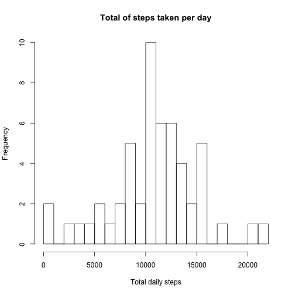
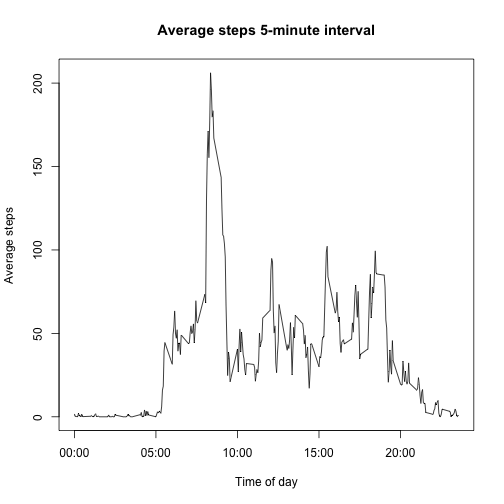
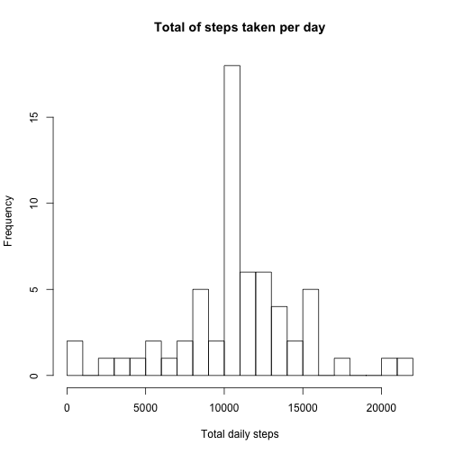
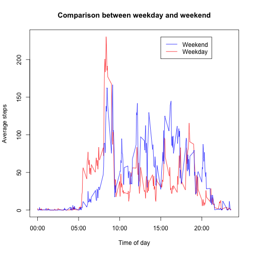

# Reproducible Research: Peer Assessment 1

This Coursera course (Reproducible Research) assignment uses data from personal activity monitoring device that collects data at 5 minute intervals through out the day. The data consists of two months of data from an anonymous individual collected during the months of October and November, 2012 and include the number of steps taken in 5 minute intervals each day.

## Loading and preprocessing the data
**1.** Load the data (i.e. read.csv())

**2.** Process/transform the data (if necessary) into a format suitable for your analysis

```r
# download and read the data, convert columns for convenience
read_data <- function() {
    fname = "activity.zip"
    source_url = "https://d396qusza40orc.cloudfront.net/repdata%2Fdata%2Factivity.zip"
    if (!file.exists(fname)) {
        download.file(source_url, destfile = fname, method = "curl")
    }
    con <- unz(fname, "activity.csv")
    tbl <- read.csv(con, header = T, colClasses = c("numeric", "character", 
        "numeric"))
    tbl$interval <- factor(tbl$interval)
    tbl$date <- as.Date(tbl$date, format = "%Y-%m-%d")
    tbl
}
tbl <- read_data()
```

```r
str(tbl)  # First look at data
```

```
## 'data.frame':	17568 obs. of  3 variables:
##  $ steps   : num  NA NA NA NA NA NA NA NA NA NA ...
##  $ date    : Date, format: "2012-10-01" "2012-10-01" ...
##  $ interval: Factor w/ 288 levels "0","5","10","15",..: 1 2 3 4 5 6 7 8 9 10 ...
```

```r
summary(tbl)
```

```
##      steps            date               interval    
##  Min.   :  0.0   Min.   :2012-10-01   0      :   61  
##  1st Qu.:  0.0   1st Qu.:2012-10-16   5      :   61  
##  Median :  0.0   Median :2012-10-31   10     :   61  
##  Mean   : 37.4   Mean   :2012-10-31   15     :   61  
##  3rd Qu.: 12.0   3rd Qu.:2012-11-15   20     :   61  
##  Max.   :806.0   Max.   :2012-11-30   25     :   61  
##  NA's   :2304                         (Other):17202
```


## What is mean total number of steps taken per day?

**1.** Make a histogram of the total number of steps taken each day

```r
hist(tapply(tbl$steps, tbl$date, sum), xlab = "Total daily steps", breaks = 20, 
    main = "Total of steps taken per day")
```

 


**2.** Calculate and report the mean and median total number of steps taken per day

```r
total.daily.steps <- tapply(tbl$steps, tbl$date, sum)
step.mean <- mean(total.daily.steps, na.rm = T)
step.median <- median(total.daily.steps, na.rm = T)
step.mean
```

```
## [1] 10766
```

```r
step.median
```

```
## [1] 10765
```

**The mean and median of total number of steps taken per day are 10766.19 and 10765 respectively.**

## What is the average daily activity pattern?

**1.** Make a time series plot (i.e. type = "l") of the 5-minute interval (x-axis) and the average number of steps taken, averaged across all days (y-axis)

```r
interval.mean <- tapply(tbl$steps, tbl$interval, mean, na.rm = T)
intervals <- data.frame(intervals = as.numeric(levels(tbl$interval)), interval.mean)
intervals <- intervals[order(intervals$intervals), ]

labels <- c("00:00", "05:00", "10:00", "15:00", "20:00")
labels.at <- seq(0, 2000, 500)
plot(intervals$intervals, intervals$interval.mean, type = "l", main = "Average steps 5-minute interval", 
    ylab = "Average steps", xlab = "Time of day", xaxt = "n")
axis(side = 1, at = labels.at, labels = labels)
```

 


**2.** Which 5-minute interval, on average across all the days in the dataset, contains the maximum number of steps?

```r
intervals.sorted <- intervals[order(intervals$interval.mean, decreasing = TRUE), 
    ]
head(intervals.sorted)
```

```
##     intervals interval.mean
## 835       835         206.2
## 840       840         195.9
## 850       850         183.4
## 845       845         179.6
## 830       830         177.3
## 820       820         171.2
```

```r
max.interval <- intervals.sorted$intervals[1[1]]
max.interval
```

```
## [1] 835
```

**The 5-minute interval with the highest average number of steps corresponds to the interval between 8:35 AM and 8:40 AM.**

## Imputing missing values

**1.** Calculate and report the total number of missing values in the dataset (i.e. the total number of rows with NAs)

```r
summary(tbl)
```

```
##      steps            date               interval    
##  Min.   :  0.0   Min.   :2012-10-01   0      :   61  
##  1st Qu.:  0.0   1st Qu.:2012-10-16   5      :   61  
##  Median :  0.0   Median :2012-10-31   10     :   61  
##  Mean   : 37.4   Mean   :2012-10-31   15     :   61  
##  3rd Qu.: 12.0   3rd Qu.:2012-11-15   20     :   61  
##  Max.   :806.0   Max.   :2012-11-30   25     :   61  
##  NA's   :2304                         (Other):17202
```

**The total number of missing values in the dataset (i.e. the total number of rows with NAs) is 2304.**

**2.** Devise a strategy for filling in all of the missing values in the dataset. The strategy does not need to be sophisticated. For example, you could use the mean/median for that day, or the mean for that 5-minute interval, etc.

**To populate missing values, I replace them with the mean value at the same interval across days. The choice is based on the assumption that activities usually follow a daily pattern.**

```r
steps <- vector()
for (i in 1:dim(tbl)[1]) {
    if (is.na(tbl$steps[i])) {
        steps <- c(steps, intervals$interval.mean[intervals$intervals == tbl$interval[i]])
    } else {
        steps <- c(steps, tbl$steps[i])
    }
}
```


**3.** Create a new dataset that is equal to the original dataset but with the missing data filled in.

```r
activity.without.missing.data <- data.frame(steps = steps, date = tbl$date, 
    interval = tbl$interval)
summary(activity.without.missing.data)  #Summarizing the new dataset with imputed values
```

```
##      steps            date               interval    
##  Min.   :  0.0   Min.   :2012-10-01   0      :   61  
##  1st Qu.:  0.0   1st Qu.:2012-10-16   5      :   61  
##  Median :  0.0   Median :2012-10-31   10     :   61  
##  Mean   : 37.4   Mean   :2012-10-31   15     :   61  
##  3rd Qu.: 27.0   3rd Qu.:2012-11-15   20     :   61  
##  Max.   :806.0   Max.   :2012-11-30   25     :   61  
##                                       (Other):17202
```


**4.** Make a histogram of the total number of steps taken each day and calculate and report the mean and median total number of steps taken per day. Do these values differ from the estimates from the first part of the assignment? What is the impact of imputing missing data on the estimates of the total daily number of steps?

```r
hist(tapply(activity.without.missing.data$steps, activity.without.missing.data$date, 
    sum), xlab = "Total daily steps", breaks = 20, main = "Total of steps taken per day")
```

 

```r

total.daily.steps <- as.numeric(tapply(activity.without.missing.data$steps, 
    activity.without.missing.data$date, sum))
step.mean <- mean(total.daily.steps)
step.median <- median(total.daily.steps)
step.mean
```

```
## [1] 10766
```

```r
step.median
```

```
## [1] 10766
```

**Comparing with the calculations done in the first section of this document, we observe that while the mean value remains unchanghed, the median value has shifted closer to the mean.**

## Are there differences in activity patterns between weekdays and weekends?

**1.** Create a new factor variable in the dataset with two levels; weekday and weekend, indicating whether a given date is a weekday or weekend day.

```r
activity.without.missing.data$day.type <- c("weekend", "weekday", "weekday", 
    "weekday", "weekday", "weekday", "weekend")[as.POSIXlt(activity.without.missing.data$date)$wday + 
    1]
activity.without.missing.data$day.type <- as.factor(activity.without.missing.data$day.type)

weekday <- activity.without.missing.data[activity.without.missing.data$day.type == 
    "weekday", ]
weekend <- activity.without.missing.data[activity.without.missing.data$day.type == 
    "weekend", ]
```


**2.** Make a panel plot containing a time series plot (i.e. type = "l") of the 5-minute interval (x-axis) and the average number of steps taken, averaged across all weekday days or weekend days (y-axis)

```r
weekday.means <- as.numeric(tapply(weekday$steps, weekday$interval, mean))
weekend.means <- as.numeric(tapply(weekend$steps, weekend$interval, mean))

intervals.day.type <- data.frame(intervals = as.numeric(levels(tbl$interval)), 
    weekday.means, weekend.means)
intervals.day.type <- intervals.day.type[order(intervals.day.type$intervals), 
    ]

plot(intervals.day.type$intervals, intervals.day.type$weekday.means, type = "l", 
    col = "red", ylab = "Average steps", xlab = "Time of day", main = "Comparison between weekday and weekend", 
    xaxt = "n")
axis(side = 1, at = labels.at, labels = labels)
lines(intervals.day.type$intervals, intervals.day.type$weekend.means, type = "l", 
    col = "blue")
legend(1500, 230, c("Weekend", "Weekday "), lty = c(1, 1), lwd = c(1, 1), col = c("blue", 
    "red"))
```

 

**We observe that activity on the weekends tends to be more spread out over the day compared to the weekdays. This could be due to the fact that activities on weekdays mostly follow a work related routine, whereas weekends tend to be more adhoc.**
